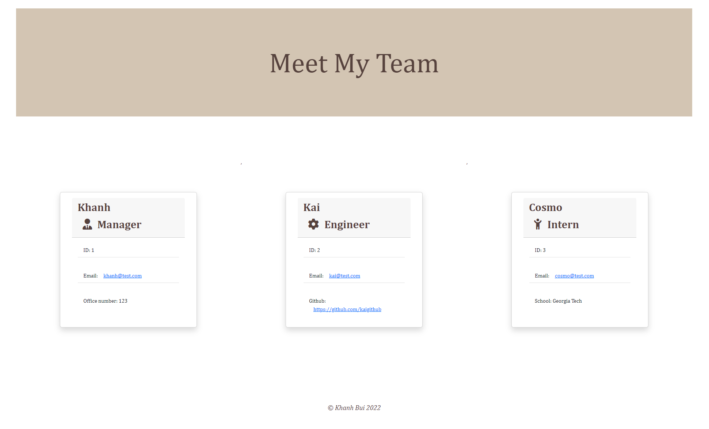

# Team Profile Generator
 A CLI-based UI tool for employee managenent created with HTML, CSS, JavaScript, Bootstrap, jQuery, Node.js, and tested with Jest

## Description

This application will populate a team profile for the user based on the responses that are received from the prompted questions in the terminal.<br>
Click [HERE](https://drive.google.com/file/d/18Tt-qrgQEsX21YoGwewQhlBbbI9qlcIk/view) to view a full video demonstrating a walkthrough of how to run the application. <br><br>

<br><br>




    
## Table of Contents
    
- [Description](#description)
- [Installation](#installation)
- [Technologies Used](#technologies-used)
- [Usage](#usage)
- [License](#license)
- [Contribution](#contribution)
- [Tests](#tests)
- [Questions](#questions)
    
## Installation
    
```
npm install
```
## Technologies Used

Front End:
* HTML
* CSS
* JavaScript
* jQuery
* Bootstrap

Back End:
* Node.js
* npm
* Jest
* Inquirer

## Usage
    
After downloading the jest and the node packages, the user can access the application through the terminal, and will be promted with questions regarding their team members. The answers received from the user will be used to generate an HTML file (my-team.html), and this file can be found in 'dist' folder.
    
    
## License
    
N/A
    
## Contribution
    
If you would like to contribute, please contact me at pkkhanhbui@gmail.com.

## Tests
    
[](https://img.shields.io/badge/tests%20passing-100%25-blue)

 This project was tested with Jest and passed all tests.
    
## Questions
    
If there are any questions or concerns, please contact me at:<br>
[GitHub](https://github.com/khanhpbui)<br>
[Email](mailto:pkkhanhbui@gmail.com)
